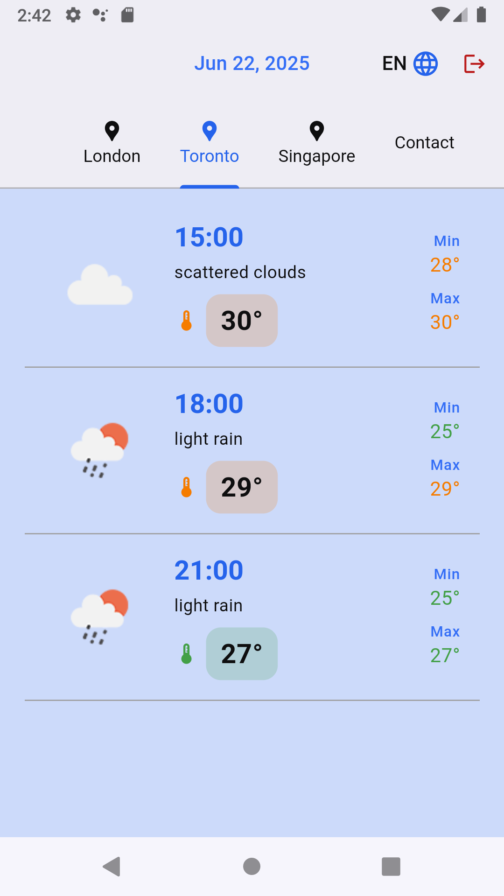

# Clima SOLID

Small demonstration of Flutter knowledge.

This application allows checking the weather (in three-hour intervals) of different cities using the [OpenWeatherMap](https://openweathermap.org/) API.

## Features

- Real-time language selector (English or Spanish)
- Weather check by cities: London, Toronto, and Singapore
- 3-hour interval weather forecast
- Validated contact form
- Architecture based on Cubits and layer separation
- Email and password login
- Persistent session management

## SOLID Principles

Each class has a single responsibility. Cubits exclusively manage state and presentation logic, services handle API calls or infrastructure tasks, repositories encapsulate business logic, and views and widgets are solely responsible for displaying the user interface.

The app can be extended without needing to modify existing classes.

Classes can be replaced by others that implement the same interface without affecting app behavior.

Classes only depend on what they really need, with no unnecessary implementations.

## Screenshots
 

## Structure
```text
lib/
├── main.dart            # Repository and bloc configuration
├── theme.dart           # Global color and style definitions

├── blocs/               # State management
│   ├── weather_cubit.dart
│   ├── weather_state.dart
│   ├── auth_cubit.dart
│   ├── auth_state.dart
│   ├── login_cubit.dart
│   ├── login_state.dart
│   ├── contact_form_state.dart
│   └── contact_form_cubit.dart

├── models/              # Domain entities and JSON mappings
│   ├── city_model.dart
│   ├── contact_model.dart
│   └── hour_weather_model.dart

├── repositories/        # Interfaces and business logic
│   ├── weather_repository.dart
│   └── city_repository.dart

├── services/            # HTTP calls, infrastructure services
│   ├── weather_api_service.dart
│   ├── contact_service.dart
│   ├── login_service.dart
│   └── auth_service.dart

├── views/               # App screens
│   ├── login_screen.dart
│   ├── home_screen.dart
│   ├── city_weather_tab.dart
│   ├── contact_form_tab.dart
│   └── splash_screen.dart

├── navigation/          # Automatic navigation handling
│   └── auth_routes.dart

├── widgets/             # Reusable components
│   ├── weather_info.dart
│   ├── language_button.dart
│   └── logout_button.dart

└── utils/               # Helper functions
    ├── form_validator.dart
    ├── forecast_filter.dart 
    └── date_formatter.dart 
```

## Tests

This project includes unit tests.
In 'login_test.dart', email and password validation, successful submission flow, and error handling are tested.
In 'weather_test.dart', behavior is checked for both success and failure when fetching weather data. JSON deserialization from the OpenWeatherMap API is also tested.

## Notes

- **IMPORTANT**: The OpenWeatherMap API key is injected at compile time using --dart-define. This allows running the app without exposing credentials in the source code.
- You can log in using **any email and password** (authentication is mocked).
- The current folder organization separates responsibilities by file type. In production, it could evolve to a feature-based organization.

## Possible future improvements

- User authentication from a database
- Retry logic separated from the service
- Image caching
- City search
- Mark favorite cities
- View more details when tapping on an hour

## Execution
The version has been updated to the latest stable release at the time of the technical test.
Flutter 3.32.5 • channel stable
```bash
flutter pub get
```

**IMPORTANT**: To run the application, you must provide your token (e.g., 1234) with the following command:
```bash
flutter run --dart-define=API_KEY=1234
```
You can get your free token from: https://home.openweathermap.org/api_keys

Token activation may take a few minutes after creation on the website.


